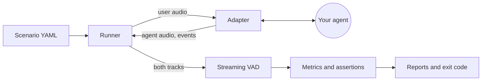

# voicebench

Measure how a real-time voice agent actually behaves in a conversation: how fast it answers, whether it stops when you interrupt it, and whether a cough makes it stop talking.

[](https://github.com/superintelligenceco/voicebench/actions/workflows/ci.yml)
[](LICENSE)
[](https://pypi.org/project/voicebench/)
[](pyproject.toml)
[](https://superintelligenceco.github.io/voicebench/)
[](https://scorecard.dev/viewer/?uri=github.com/superintelligenceco/voicebench)

[](https://codespaces.new/superintelligenceco/voicebench?quickstart=1)

voicebench plays a scripted conversation into your agent, records both sides of the call as audio, and derives every metric from that audio with a voice activity detector. It works with any agent you can reach over a transport: a plain WebSocket that streams PCM, a LiveKit room, a Pipecat bot, or your own adapter.


Read the full documentation at [superintelligenceco.github.io/voicebench](https://superintelligenceco.github.io/voicebench/).

## Install

Install voicebench from PyPI, or use the standalone executable or the container image that each release ships. The executable and the image include the `mock` and `websocket` adapters. For the `livekit` and `pipecat` adapters, install the Python package with the matching extra.

### Python package

Install the package from [PyPI](https://pypi.org/project/voicebench/), and add an extra for the LiveKit or Pipecat adapter:

```sh
python -m pip install voicebench
python -m pip install "voicebench[pipecat]"
```

Each GitHub Release also attaches the wheel and the sdist.

### Install script

On Linux (x86-64 or ARM64) or macOS on Apple silicon, the install script downloads the executable for your platform from the latest release, checks it against `SHA256SUMS`, and puts it in `~/.local/bin`:

```sh
curl -fsSL https://raw.githubusercontent.com/superintelligenceco/voicebench/main/install.sh | sh
```

Set `VOICEBENCH_VERSION=v0.2.0` to pin a release, or `VOICEBENCH_INSTALL_DIR` to choose another directory.

### Standalone executable

The executable needs no Python. Download the file for your platform from the [latest release](https://github.com/superintelligenceco/voicebench/releases/latest):

| Platform | Asset |
| --- | --- |
| Linux x86-64 (glibc 2.31 or later) | `voicebench-linux-x64` |
| Linux ARM64 (glibc 2.31 or later) | `voicebench-linux-arm64` |
| macOS on Apple silicon | `voicebench-macos-arm64` |
| Windows x86-64 | `voicebench-windows-x64.exe` |

```sh
curl -fLO https://github.com/superintelligenceco/voicebench/releases/latest/download/voicebench-linux-arm64
curl -fLO https://github.com/superintelligenceco/voicebench/releases/latest/download/SHA256SUMS
sha256sum --check --ignore-missing SHA256SUMS
chmod +x voicebench-linux-arm64
./voicebench-linux-arm64 example mock-conversation -O demo.yaml
./voicebench-linux-arm64 run demo.yaml
```

The executables are not code-signed. On macOS, clear the quarantine flag before the first run with `xattr -d com.apple.quarantine voicebench-macos-arm64`.

### Container image

The image supports `linux/amd64` and `linux/arm64`. Release tags publish `:X.Y.Z` and `:latest`. Manual runs of the Release workflow publish `:edge`.

```sh
docker run --rm ghcr.io/superintelligenceco/voicebench:latest example mock-conversation > demo.yaml
docker run --rm -v "$PWD:/work" ghcr.io/superintelligenceco/voicebench:latest run demo.yaml
```

The container works in `/work`, so mount the directory that holds your scenario there. To serve the mock agent from a container, run `docker run --rm -p 8765:8765 ghcr.io/superintelligenceco/voicebench:latest mock-server --host 0.0.0.0`.

```console
$ voicebench run examples/mock-conversation.yaml --no-write
voicebench 0.2.0  scenario=mock-conversation  adapter=mock  clock=virtual  sessions=1

Turn         Expect   Response  TTFA    Stop    WER  Result
-----------  -------  --------  ------  ------  ---  ------
opening      respond  760 ms    760 ms  -       0    pass
answer-date  respond  700 ms    700 ms  -       0    pass
barge-in     stop     660 ms    660 ms  380 ms  0    pass
cough        ignore   -         -       -       -    pass
confirm      respond  660 ms    660 ms  -       0    pass

Turns passed                   5/5
Response latency p50 / p90     700 ms / 748 ms
Time to first audio p50 / p90  700 ms / 748 ms
Missed responses               0
Barge-in success               100% of 1
Barge-in stop time p50 / max   380 ms / 380 ms
False barge-ins                0 of 1
Spurious responses             0
Agent talk-over                0 ms
Mean WER                       0

PASS  p90_response_latency_ms <= 1200 (actual 748)
PASS  max_barge_in_stop_ms <= 400 (actual 380)
PASS  min_barge_in_success_rate >= 1 (actual 1)
PASS  max_false_barge_ins <= 0 (actual 0)
PASS  max_wer <= 0.1 (actual 0)
```

That output comes from the bundled mock agent, whose delays you configure in the scenario. The numbers describe the mock, not any real product.

## Quickstart

```sh
git clone https://github.com/superintelligenceco/voicebench && cd voicebench
python -m pip install .
voicebench run examples/mock-conversation.yaml
```

Without a clone, save the same scenario from the bundled examples, then run it:

```sh
voicebench example mock-conversation -O demo.yaml
voicebench run demo.yaml
```

The run writes `report.json`, `report.md`, and `report.html` (with a speech timeline) to `voicebench-results/`.

## Why voicebench exists

Voice agents fail in ways that text benchmarks never see. An agent can have a fast language model and still feel slow because its endpointing waits too long. It can answer correctly and still talk over you, ignore you when you cut in, or stop mid-sentence because someone coughed. Vendor dashboards report the latency of individual pipeline stages, which does not tell you what a caller hears.

voicebench measures from the outside, at the audio. It treats your agent as a black box, so the same scenario gives comparable numbers before and after you change a model, a VAD setting, or a transport, and it can gate a CI pipeline on those numbers.

## How it works



The runner plays each turn through an adapter and records both sides of the call. The VAD finds speech in each track, and the metrics code matches agent speech to turns. Read [Architecture](https://superintelligenceco.github.io/voicebench/architecture/) for the modules and the data flow.

## Features

- **Audio-level metrics.** Response latency, time to first audio, barge-in stop time, false barge-ins, spurious responses, talk-over, and overlap, all computed from the recorded audio with an energy VAD that has hysteresis and hangover.
- **Scripted conversations in YAML.** Turns start relative to the session, the previous turn, or the agent's own speech, so you can interrupt the agent 900 ms into its reply on every run.
- **Assertions and exit codes.** Put limits in the scenario and `voicebench run` exits with status 1 when a limit fails.
- **Transcript accuracy.** If the agent reports what it heard, voicebench scores it against the expected text as word error rate.
- **Pluggable transports.** Built-in `mock` and `websocket` adapters, experimental `livekit` and `pipecat` adapters, and a small base class for your own.
- **Deterministic mock agent.** The mock runs on a virtual clock, so the whole pipeline runs offline in milliseconds and gives the same answer every time.
- **Reports for people and machines.** JSON with a versioned schema, Markdown, and self-contained HTML.

## Usage

```sh
# Run a scenario with the adapter it names.
voicebench run scenario.yaml

# Override the adapter and URL, repeat five sessions, and write only JSON.
voicebench run scenario.yaml -a websocket --url ws://127.0.0.1:8765 -n 5 --format json

# Override adapter options. Values are parsed as YAML.
voicebench run scenario.yaml -o response_delay_ms=900 -o interruptible=false

# List the bundled example scenarios, or save one to a file.
voicebench example
voicebench example websocket -O websocket.yaml

# Check scenario files without running them.
voicebench validate examples/*.yaml

# Serve the mock agent over the WebSocket protocol, to try the websocket adapter.
voicebench mock-server --port 8765

# Write a synthetic test signal to a WAV file.
voicebench synth prompt.wav --kind speech --duration-ms 1500
```

Exit codes: `0` when every assertion passes, `1` when an assertion fails, `2` for a usage or scenario error, and `3` when the adapter cannot load or connect.

You can also call voicebench from Python:

```python
import asyncio

from voicebench.bench import run_benchmark
from voicebench.scenario import load_scenario

result = asyncio.run(run_benchmark(load_scenario("examples/mock-conversation.yaml")))
print(result.summary["response_latency_ms"]["p50"], result.passed)
```

## Metrics

All times are in milliseconds. A turn's *offset* is the end of the user's speech as the VAD detects it in the recorded user track. Agent speech is detected the same way in the recorded agent track.

| Metric | Definition |
| --- | --- |
| Response latency | Time from the user's speech offset to the onset of the agent's next speech segment. Negative values mean the agent started before the user finished (talk-over). |
| Time to first audio (TTFA) | Time from the user's speech offset to the arrival of the first non-silent agent audio packet of the reply. It differs from response latency when the agent sends leading silence or the transport buffers audio. |
| Missed response | A `respond` turn where no agent speech starts within `response_timeout_ms` of the user's offset. |
| Barge-in stop time | For a `stop` turn, time from the onset of the user's interruption to the end of the agent speech segment it interrupted. |
| Barge-in success rate | Share of `stop` turns where the agent stopped within `max_stop_ms`. |
| False barge-in | An `ignore` turn (for example, a cough) where the agent was talking and stopped within `max_stop_ms` of the noise. |
| Spurious response | An `ignore` turn where the agent was silent and started talking because of the noise. |
| Talk-over | Total time the agent spoke while the user was speaking during `respond` turns. |
| Overlap | Total time both sides spoke at once, across the whole session. |
| WER | Word error rate of the agent's reported user transcript against the turn's `text`, after lowercasing and removing punctuation. |

Read [docs/metrics.md](docs/metrics.md) for the VAD algorithm, timing resolution, and known limits.

## Scenario format

```yaml
name: booking-flow
sample_rate: 16000          # session rate for all audio
frame_ms: 20                # size of each audio frame sent to the agent
adapter:
  type: websocket
  options: {url: ws://127.0.0.1:8765}
defaults:
  response_timeout_ms: 5000
turns:
  - id: question
    audio: {file: audio/question.wav}          # or {synth: speech, duration_ms: 1500}
    start: {after: session_start, delay_ms: 500}
    text: "What are your opening hours?"       # optional, enables WER
  - id: interrupt
    audio: {file: audio/interrupt.wav}
    start: {after: agent_speech_start, delay_ms: 900}
    expect: stop                               # respond (default), stop, or ignore
    max_stop_ms: 600
assert:
  p90_response_latency_ms: 1500
  min_barge_in_success_rate: 1.0
```

Read [docs/scenarios.md](docs/scenarios.md) for every key, the start anchors, and the full list of assertions.

## Adapters

| Adapter | Status | Transport |
| --- | --- | --- |
| `mock` | Stable | In-process mock agent on a virtual clock. |
| `websocket` | Stable | Binary PCM16 frames both ways, plus optional JSON `clear` and `transcript` messages. |
| `livekit` | Experimental | Joins a LiveKit room, publishes a microphone track, and records the agent's audio tracks. Install with `pip install 'voicebench[livekit]'`. |
| `pipecat` | Experimental | Pipecat's protobuf frame protocol over a WebSocket transport. Install with `pip install 'voicebench[pipecat]'`. |

The experimental adapters are real implementations, but the test suite does not run them against live services, so expect rough edges. To write your own, subclass `voicebench.adapters.Adapter` and implement `connect`, `send_audio`, and `close`. [examples/echo_adapter.py](examples/echo_adapter.py) is a complete example in 50 lines, and [docs/adapters.md](docs/adapters.md) documents the interface and the WebSocket protocol.

## Roadmap

- Neural VAD option (Silero) for the agent track, for agents with background music or noise.
- Percentile summaries across many repeated sessions, with confidence intervals.
- A turn-by-turn audio export for listening to failed turns.
- Adapters for SIP and plain WebRTC.
- A GitHub Action that runs a scenario and comments with the report.

## Contributing

Bug reports, scenarios, and adapters are welcome. Read [CONTRIBUTING.md](CONTRIBUTING.md) to set up a development environment, and follow the [code of conduct](CODE_OF_CONDUCT.md). Report security issues privately as described in [SECURITY.md](SECURITY.md).

## License

Apache License 2.0. See [LICENSE](LICENSE).
