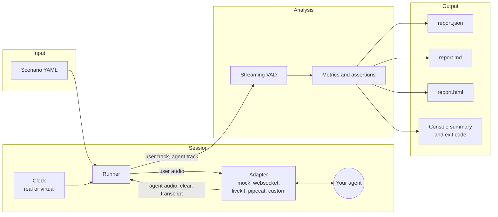

# Architecture

A voicebench run has four stages. The scenario drives the runner, the runner talks to your agent through an adapter, the metrics code analyzes the two recorded tracks, and the report writers turn the results into files and a console summary.

## Modules

| Module | Role |
| --- | --- |
| `voicebench.scenario` | Loads and validates the YAML scenario, including turn anchors and assertions. |
| `voicebench.runner` | Plays each turn at the right time, polls the adapter, and records both tracks. Turns anchored on agent speech wait for a live VAD to see the agent start or stop. |
| `voicebench.clock` | `RealClock` for network adapters, `VirtualClock` for the in-process mock agent. |
| `voicebench.adapters` | The `Adapter` base class and the built-in transports. |
| `voicebench.vad` | The energy detector with hysteresis and hangover that finds speech in each track. |
| `voicebench.metrics` | Per-turn and per-session metrics, percentiles, and assertion checks. |
| `voicebench.wer` | Word error rate for transcripts that the agent reports. |
| `voicebench.report` | JSON (schema version 1), Markdown, HTML, and console output. |
| `voicebench.bench` | The high-level API that runs a scenario one or more times and builds the report. |
| `voicebench.cli` | The `voicebench` command. |

## Data flow

1. The runner reads the scenario and asks the adapter to connect.
2. For each turn, the runner waits for the turn's anchor, then streams the turn's audio to the adapter in frames of `frame_ms`.
3. Between frames the runner polls the adapter for events: agent audio packets, `clear` events when the agent stops for a barge-in, and transcripts.
4. After the last turn and the trailing silence, the runner closes the adapter and returns a `SessionRecord` with both tracks and every event.
5. The metrics code runs the VAD over both tracks and matches agent speech segments to turns.
6. The report writers render the results, and the CLI exits with status 1 if any assertion fails.
